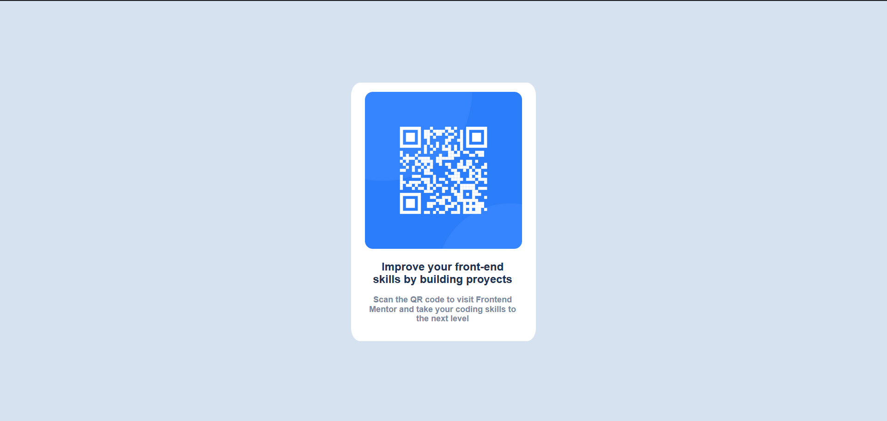

# Frontend Mentor - QR code component solution

This is a solution to the [QR code component challenge on Frontend Mentor](https://www.frontendmentor.io/challenges/qr-code-component-iux_sIO_H). Frontend Mentor challenges help you improve your coding skills by building realistic projects. 

### Screenshot

### Links

- Solution URL: [https://github.com/JuanCarlosAT96/qrcomponent]
- Live Site URL: [https://qrcomponent-jcat.netlify.app/]

## My process

### Built with

- Semantic HTML5 markup
- CSS custom properties
- Flexbox
- Normalize

### What I learned

For this proyect i use HTML where the tool what learned more is the use of Position for put the component in the center screen.

